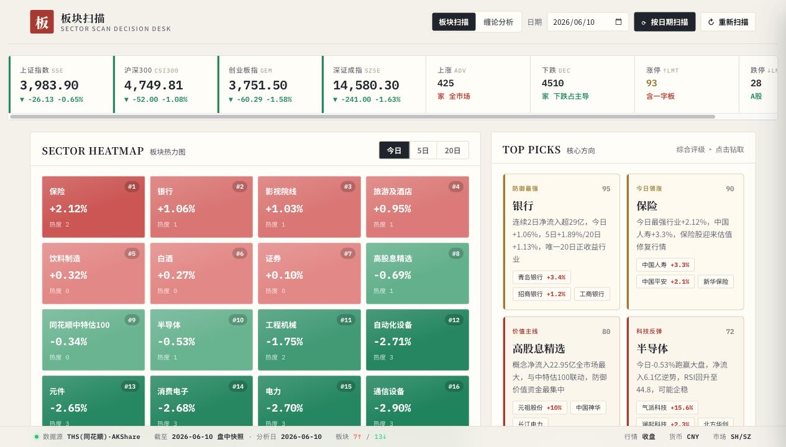

# A 股行业板块扫描与缠论分析终端

本项目是一个本地运行的 A 股板块 AI 复盘工具，面向个人投资者做行业强弱扫描和趋势感知。系统优先使用 WeStock Data / 腾讯自选股行情，AKShare 作为备用数据源；后端负责行情计算和结构识别，AI 只做复盘摘要与噪音过滤，不提供投资建议。



## 项目亮点

- 轻量本地运行：原生前端 + Python 标准库 HTTP 服务，无 Flask、FastAPI、Node 后端。
- 板块扫描聚焦行业：只分析标准行业板块，剔除概念、主题、昨日涨停等噪音标签。
- 缠论分析双页签：支持 A 股、港股、宽基指数、行业指数的日线结构复盘。
- 数据源有兜底：WeStock Data 优先，AKShare 备用，运行结果写入本地缓存。
- AI 边界清晰：兼容 OpenAI 风格模型接口，AI 只总结和解释，不覆盖原始行情指标。

## 核心功能

### 板块扫描

- 按日期扫描，非交易日或未来日期自动回退到最近可用交易日。
- 基于全量行业板块复盘，展示涨幅前 20 强板块。
- 热力图、领涨走势图和板块列表使用同一组排序结果。
- 资金流支持 1 日、5 日、20 日维度。
- 扫描结果按日期缓存；点击“重新扫描”会覆盖该日期缓存。

### 缠论分析

- 点击搜索框即可展示常用候选，按 `宽基指数 / 行业指数 / 热门股票 / 港股热门` 分组。
- 指数候选覆盖上证、深证、创业板、科创、沪深 300、中证 500/1000、红利、中证行业、全指行业等。
- 当前前端只开放日线复盘。
- 后端计算 K 线包含处理、分型、笔、线段、中枢、MACD、背驰和买卖点。
- 分析结果按 `symbol + period + date` 缓存；点击“重新分析”会覆盖同一缓存。

## 快速开始

### 1. 准备环境

需要：

- Python 3.10+
- Node.js / npx

安装 AKShare 备用依赖：

```bash
python3 -m pip install akshare pandas requests
```

### 2. 配置 AI

复制本地配置：

```bash
cp config.local.example.json config.local.json
```

在 `config.local.json` 中填写模型配置：

```json
{
  "llm": {
    "base_url": "https://coding.dashscope.aliyuncs.com/v1",
    "model": "glm5",
    "api_key": "",
    "temperature": 0.2,
    "timeout_seconds": 45
  }
}
```

也可以使用环境变量覆盖：

```bash
export LLM_BASE_URL="https://coding.dashscope.aliyuncs.com/v1"
export LLM_MODEL="glm5"
export LLM_API_KEY="your-api-key"
```

`config.local.json` 已加入 `.gitignore`，不要提交真实 key。

### 3. 启动服务

```bash
python3 server.py --host 127.0.0.1 --port 8765
```

访问：

```text
http://127.0.0.1:8765/
http://127.0.0.1:8765/chanlun
```

macOS 可双击 `start_server.command` 启动。

## 数据源

默认主数据源是 WeStock Data，不需要行情 key，但需要本机可运行 `npx` 并访问腾讯自选股接口。

验证命令：

```bash
npx -y westock-data-clawhub@1.0.4 board
npx -y westock-data-clawhub@1.0.4 kline sh000001 --period day --limit 5
```

AKShare 是备用数据源。若要直接使用 AKShare，可在 `config.local.json` 中设置：

```json
{
  "market": {
    "primary_source": "akshare"
  }
}
```

## 使用方式

- 板块扫描：选择日期，点击“按日期扫描”；需要刷新数据时点击“重新扫描”。
- 缠论分析：进入“缠论分析”页签，搜索或直接选择候选标的，选择日期后自动分析；需要刷新数据时点击“重新分析”。
- 页面会展示实际分析日期、数据源、缓存状态和 AI 状态。

## 接口

```text
GET /api/scan?date=YYYY-MM-DD
GET /api/scan?date=YYYY-MM-DD&refresh=1
```

返回板块扫描完整数据，包含 `meta / indices / heatmap / sectors / flows / signals / picks / trend / tech / strategy` 等字段。

```text
GET /api/chanlun/search?q=腾讯&market=all
GET /api/chanlun/search?q=&market=index
```

搜索 A 股、港股和指数。`q` 为空时返回内置常用候选；`market` 支持 `all / a / hk / index`。

```text
GET /api/chanlun/analyze?symbol=600519&period=day&date=2026-06-12
GET /api/chanlun/analyze?symbol=sh000932&period=day&refresh=1
```

返回缠论分析结果，包含 `meta / stock / bars / analysis / verdict / ai`。

## 缓存与安全

- 板块扫描缓存：`.cache/scan_request_YYYY-MM-DD.json`
- 缠论分析缓存：`.cache/chanlun_{symbol}_{period}_{date}.json`
- 本地配置：`config.local.json`

`config.local.json`、`.cache/`、`__pycache__/`、`uploads/`、`bridge/`、本机 `plist` 和 macOS 资源文件不会提交到 Git。提交前请确认 README、前端源码、缓存样例和提交历史里没有真实 API key。

## 部署建议

- 推荐部署在个人电脑、本地开发机、NAS 或内网服务器。
- 局域网访问可用 `--host 0.0.0.0`，但需要自行加访问控制。
- 不建议裸露到公网；GitHub Pages 也不适合本项目，因为无法运行后端接口或安全保存 AI key。
- 给 Claude Code、Codex 等编程智能体部署时，按“装依赖 -> 配置 key -> 验证数据源 -> 启动服务 -> 打开页面”执行即可。

## 开发与许可

开发原则：

- 保持轻量，优先复用标准库和现有结构。
- AI key 只允许放在本地配置或环境变量中。
- 行情指标、排序、资金和缠论结构由后端规则计算，AI 只生成复盘文案。
- 数据源调用必须保留缓存或静态快照兜底。

本项目源码可见，仅允许个人学习、研究、复盘和非商业本地使用；不支持二次商用、转售、白标、付费托管或作为商业服务交付。详细条款见 [LICENSE](LICENSE)。

## 项目结构

```text
.
├── A股板块分析终端.html
├── app.js
├── terminal.css
├── server.py
├── data.js
├── config.local.example.json
├── start_server.command
├── LICENSE
├── docs/
│   └── screenshot.jpg
└── 缠论/
    ├── index.html
    ├── styles.css
    └── js/
        ├── data.js
        ├── app.jsx
        ├── chart.jsx
        └── sections.jsx
```

## 免责声明

本项目仅用于行情复盘、研究和技术演示，不构成投资建议。市场数据可能延迟、缺失或因源站接口变更而异常，AI 生成内容也可能存在误判。
